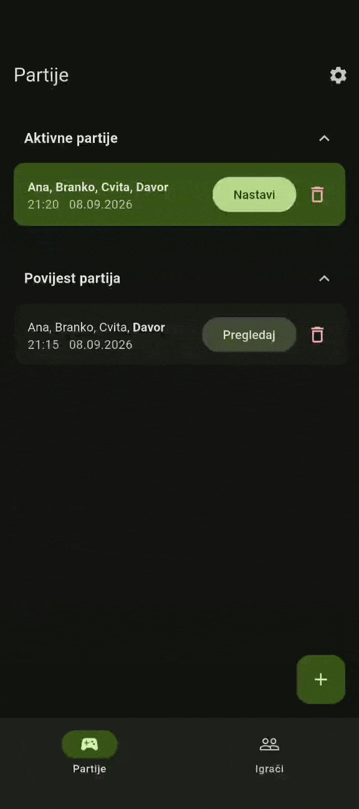
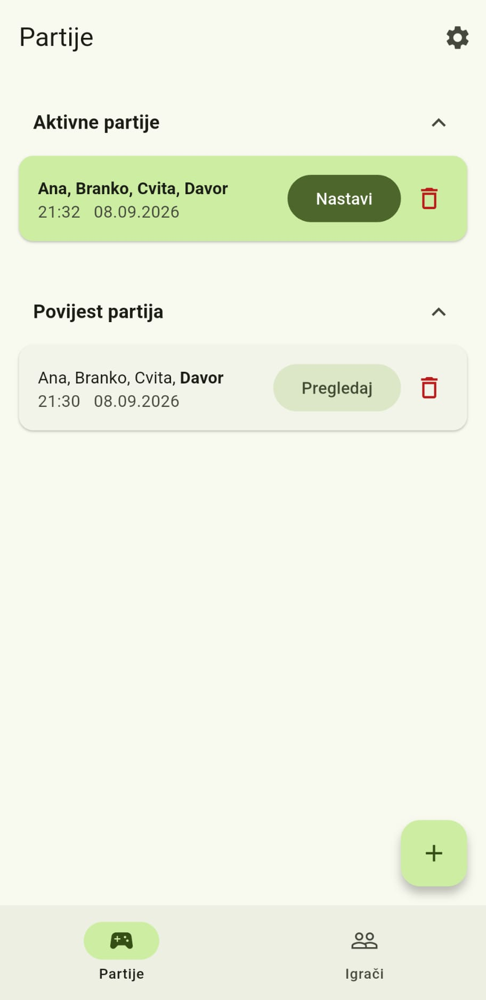
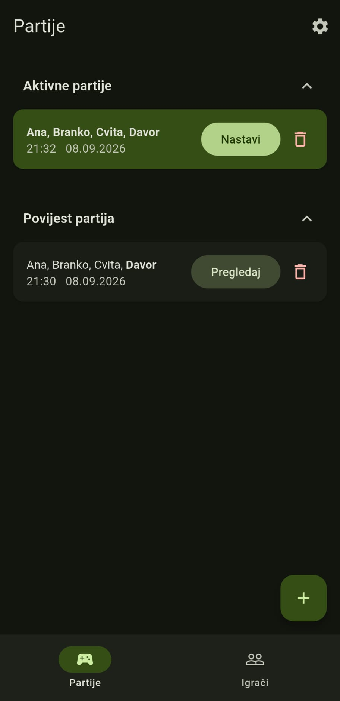
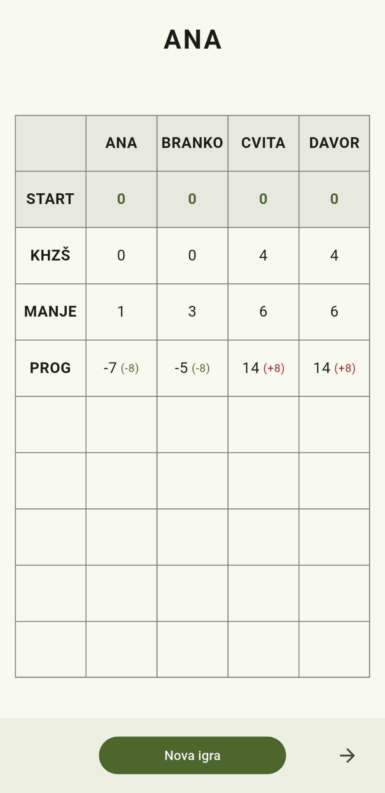
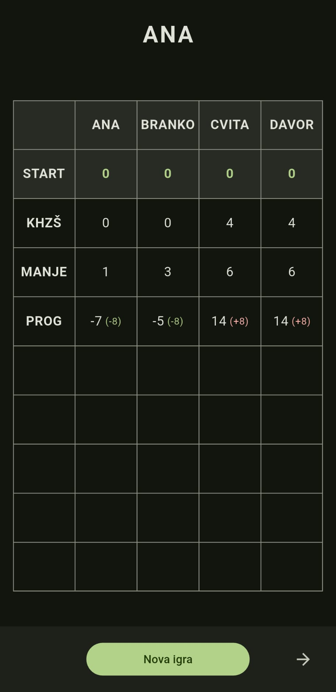

<div align="center">


# Lora Blok

Moderan digitalni blok za praćenje rezultata u kartaškoj igri Lora.

[](https://flutter.dev)
[](https://dart.dev)
[](https://android.com)
[](https://sqlite.org)

</div>

---

## 📸 Prikaz sučelja

### Demo

<p align="center">
  
</p>

### Svijetla / Tamna Tema

<p align="center">
  
  &nbsp;
  
</p>

<p align="center">
  
  &nbsp;
  
</p>

---

## ✨ Značajke

- **Potpuno praćenje igre**: Prati sve igrače, runde i rezultate u stvarnom vremenu.
- **8 dinamičnih mini-igara**: Ugrađena stroga provjera i validacija rezultata za _Dečko Preko Puta_, _Dame_, _Kralj Herc Zadnji Štih_, _Herčevi_, _Manje_, _Više_, _Prognoza_ i _Slaganje_.
- **Offline pohrana podataka**: Pokretana SQLite-om, aplikacija sprema vaše aktivne igre i povijest izravno na uređaj, radeći potpuno offline.
- **Moderan Material 3 dizajn**: Prekrasno, responzivno i intuitivno korisničko sučelje izgrađeno u Flutteru, uz podršku za tamni i svijetli način rada.

---

## 🏗️ Arhitektura projekta

Ovaj projekt je strukturiran za skalabilnost i čist kod:

- **Modeli (`/lib/models`)**: Apstraktni podatkovni modeli strogo upravljaju poslovnom logikom i pravilima provjere za svaku mini-igru, potpuno neovisno o korisničkom sučelju.
- **Baza podataka (`/lib/database`)**: Sirovi SQL upiti koristeći `sqflite` osiguravaju brzu, trajnu i offline pohranu podataka na uređaju.
- **Widgeti (`/lib/widgets`)**: Korisničko sučelje razbijeno je na modularne, ponovno iskoristive komponente (poput `ScoreboardTable` i `GameSelector`) kako bi datoteke s ekranima ostale čiste i pregledne.

---

## 📥 Preuzimanje i instalacija

### Izravno preuzimanje (APK)

Preuzmite najnoviju verziju aplikacije izravno za vaš Android uređaj:

[](https://github.com/vujnovicmarko/lora_blok/releases/latest)

- 📱 **[Izravno preuzimanje APK datoteke](https://github.com/vujnovicmarko/lora_blok/releases/latest/download/app-release.apk)**

### Provjera integriteta

Kako biste bili sigurni da preuzeta datoteka nije oštećena, možete usporediti SHA-1 otisak vaše datoteke s objavljenom `.sha1` datotekom iz izdanja:

```bash
# macOS / Linux
shasum -a 1 -c app-release.apk.sha1

# Windows PowerShell
(Get-FileHash app-release.apk -Algorithm SHA1).Hash
```

---

### Kompajliranje iz izvornog koda

```bash
# Klonirajte repozitorij
git clone [https://github.com/vujnovicmarko/lora_blok.git](https://github.com/vujnovicmarko/lora_blok.git)

# Uđite u direktorij
cd lora_blok

# Preuzmite ovisnosti
flutter pub get

# Izradite Android APK
flutter build apk
```
